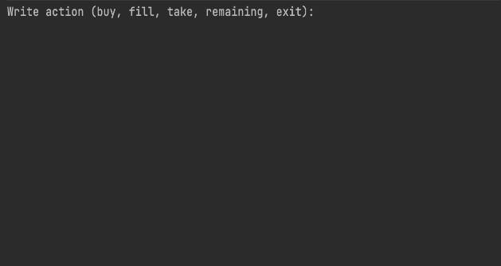

# CoffeeMachine.
In this project, you will work on programming a coffee machine simulator. The machine works with typical products: coffee, milk, sugar, and plastic cups; if it runs out of something, it shows a notification. You can get three types of coffee: espresso, cappuccino and latte. Since nothing’s for free, it also collects the money.
+ The system is implemented in Java.
+ My implementation of [Hyperskill.org](https://hyperskill.org/projects/33?track=1)

Created 15.03.2021

